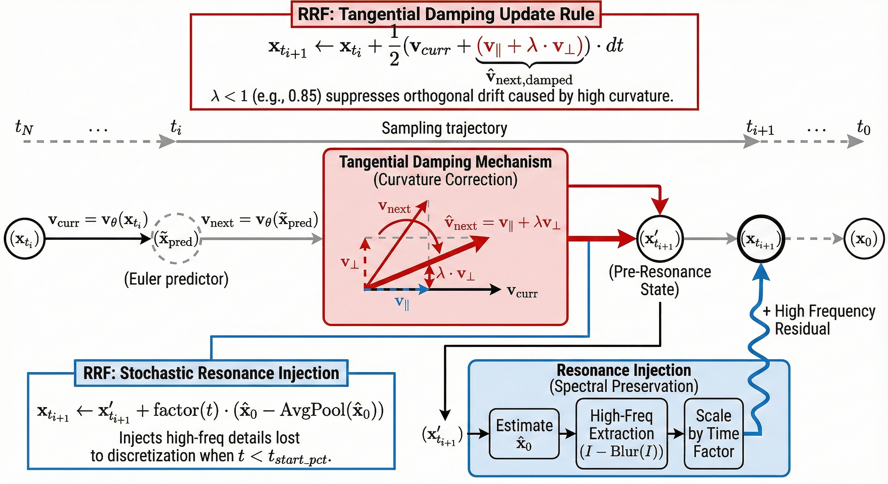
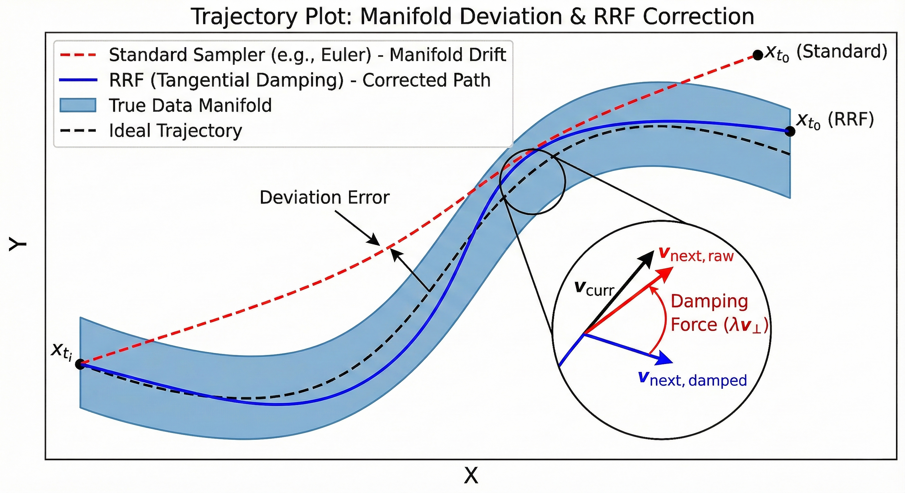
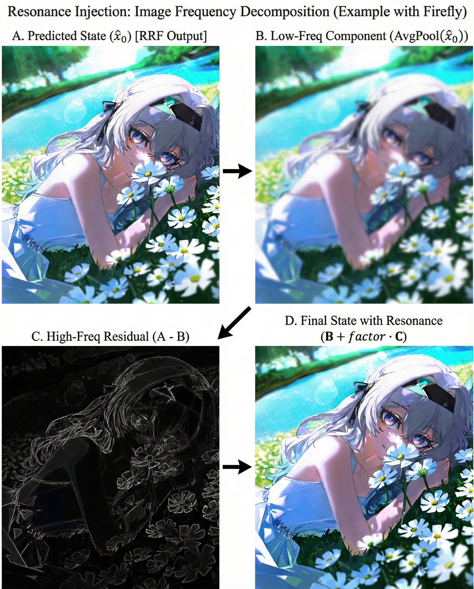

# Relativistic Resonant Flow (RRF): High-Fidelity Sampling for Rectified Flow Models via Tangential Damping and Stochastic Resonance

**Created by:** Mohammad Farid Hendianto ([IRedDragonICY](https://github.com/IRedDragonICY))

<p align="center">
  
</p>

This repository contains the PyTorch implementation of the **Relativistic Resonant Flow (RRF)** sampler. This novel discretization method is designed to mitigate manifold deviation in Rectified Flow models, particularly under conditions of high Classifier-Free Guidance (CFG).

RRF addresses the curvature of the generative trajectory by decomposing the velocity vector into parallel and orthogonal components, applying tangential damping to reduce artifacts, and injecting resonant high-frequency details to counteract discretization dissipation.

## Abstract

Rectified Flow models facilitate generation via Ordinary Differential Equations (ODEs). However, standard solvers (e.g., Euler, Heun) often struggle with the high curvature induced by guidance scales, leading to "burn" artifacts and loss of fine texture.

We propose **Relativistic Resonant Flow (RRF)**, which introduces:
1.  **Tangential Damping:** A geometric correction that projects the lookahead velocity vector onto the current trajectory, damping the orthogonal component responsible for manifold drift.
2.  **Stochastic Resonance Injection:** A spectral enhancing technique that reintroduces high-frequency components—extracted via a Difference of Gaussians (DoG) approximation—during the refinement stages to improve perceptual fidelity.

## Theoretical Framework

### 1. Tangential Damping (Curvature Correction)

<p align="center">
  
</p>

Given the current velocity $v_t$ and a lookahead velocity estimate $v_{next}$, standard second-order methods average these vectors directly. RRF argues that the component of $v_{next}$ orthogonal to $v_t$ represents curvature that may lead to off-manifold drift (as illustrated in the trajectory plot above).

We decompose $v_{next}$ as:

$$
v_{next} = v_{\parallel} + v_{\perp}
$$

Where:

$$
v_{\parallel} = \left( \frac{v_{next} \cdot v_t}{\|v_t\|^2} \right) v_t
$$

The corrected lookahead velocity is computed by damping the orthogonal component by a factor $\lambda$ (Tangential Damping):

$$
\hat{v}_{next} = v_{\parallel} + \lambda \cdot v_{\perp}
$$

The final update step approximates a Crank-Nicolson scheme using the damped vector.

### 2. Resonant Frequency Injection

<p align="center">
  
</p>

To counteract the smoothing effects of numerical integration (spectral dissipation), we define a resonance term $R(x)$ based on the high-frequency spatial features of the predicted state $\hat{x}_0$.

As visualized in the figure above, we extract high-frequency residuals using a fast approximation:

$$
R(x) = \hat{x}_0 - \text{AvgPool}(\hat{x}_0)
$$

This residual is injected back into the trajectory with a time-dependent scaling factor, ensuring texture preservation (sharpness) without disrupting the semantic structure.

## Implementation & Usage

The core logic is self-contained in `auraflow_rrf.py`. To use this in ComfyUI, integration into the internal sampler dispatch is required.

### Parameters

*   `TANGENTIAL_DAMPING` (default: 0.85): Controls the suppression of orthogonal drift. Lower values reduce high-CFG artifacts but may reduce compositional adherence.
*   `RESONANCE_START_PCT` (default: 0.2): The percentage of the sampling process elapsed before resonance injection activates (prevents hallucinating details during the initial structural phase).

## Citation

If you find this work useful in your research, please consider citing:

```bibtex
@misc{hendianto2025rrf,
  author = {Hendianto, Mohammad Farid},
  title = {Relativistic Resonant Flow: High-Fidelity Sampling via Tangential Damping},
  year = {2025},
  publisher = {GitHub},
  journal = {GitHub repository},
  howpublished = {\url{https://github.com/IRedDragonICY/auraflow_rrf}}
}
